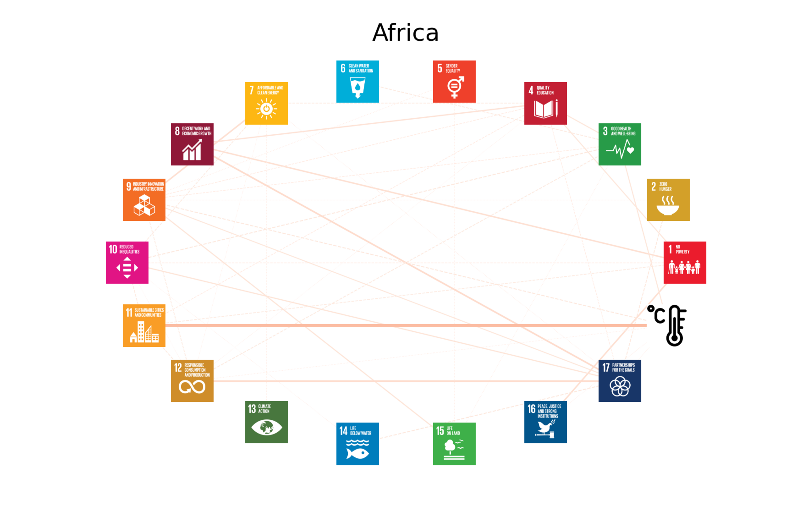
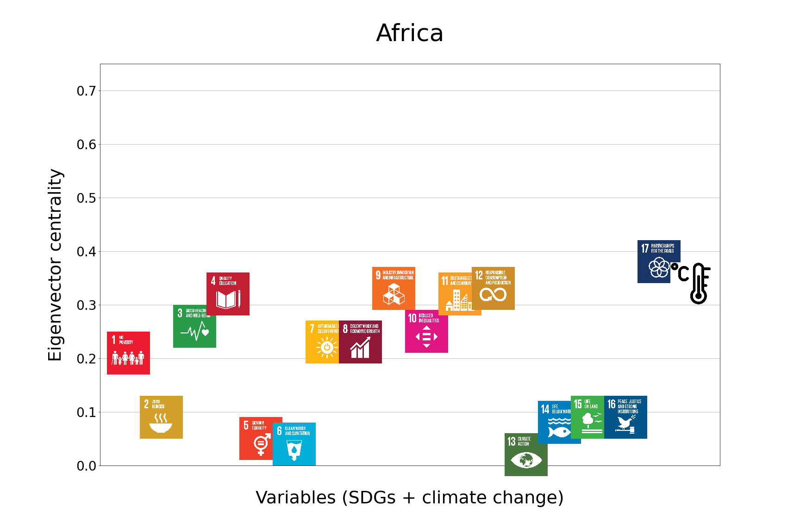
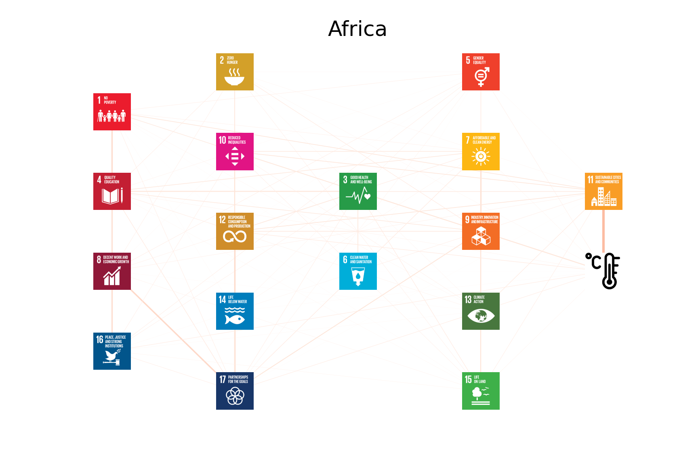

## Africa

 
 

---

Click <a href="TLPH_website_tables_6-6.pdf" target="_blank">here</a> for the exact numerical results for the **strength** of each relationship, the conditional set of variables that resulted in the minimum partial distance correlation, and the _p_-value of the conditional independence test.

