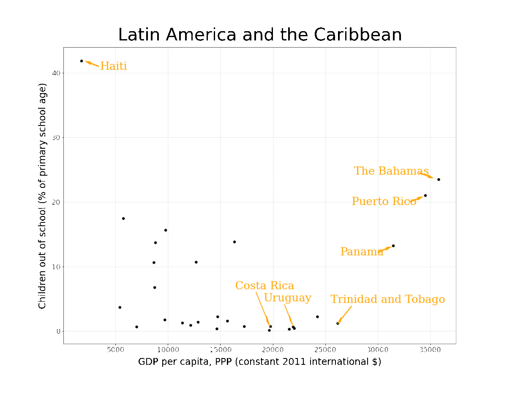

# Complex interlinkages, key objectives, and nexuses among the Sustainable Development Goals and climate change: a network analysis

_[Direct link to Results](#results)_

This website allows you to explore the results of the publication *Complex interlinkages, key objectives, and nexuses among the Sustainable Development Goals and climate change: a network analysis* that is freely available at [The Lancet Planetary Health](https://www.thelancet.com/journals/lanplh/article/PIIS2542-5196(22)00070-5/fulltext).

Given the large analysis over 35 country groupings, most of the results are found in the [Supplementary Material](https://www.thelancet.com/journals/lanplh/article/PIIS2542-5196(22)00070-5/fulltext#supplementaryMaterial) of this publication. This website is intended to make the search for results of specific country groupings more accessible.

The two main differences of our approach to existing studies are the consideration of non-linear (non-monotonic) relationships, how the following animated figure explains, and the consideration that any dependence (or correlation) between two variables may originate from a third variable, that is not taken into account. These _third_ variables are called confounders or lurking variables and make the dependence between the two variables spurious.

---

<h3 id="results">Find results for specific country groupings:</h3>

- [World](https://felix-laumann.github.io/SDG-networks/Results/World/World.html)
    - [Global North](https://felix-laumann.github.io/SDG-networks/Results/Global_North/Global_North.html)
    - [Global South](https://felix-laumann.github.io/SDG-networks/Results/Global_South/Global_South.html)

- [Africa](https://felix-laumann.github.io/SDG-networks/Results/Africa/Africa.html)
    - [Sub-Saharan Africa](https://felix-laumann.github.io/SDG-networks/Results/Sub-Saharan_Africa/Sub-Saharan_Africa.html)
    - [Southern and Eastern Africa](https://felix-laumann.github.io/SDG-networks/Results/Southern_and_Eastern_Africa/Southern_and_Eastern_Africa.html)
    - [Middle Africa](https://felix-laumann.github.io/SDG-networks/Results/Middle_Africa/Middle_Africa.html)
    - [Northern and Western Africa](https://felix-laumann.github.io/SDG-networks/Results/Northern_and_Western_Africa/Northern_and_Western_Africa.html)

- [Americas](https://felix-laumann.github.io/SDG-networks/Results/Americas/Americas.html) 
    - [Latin America and the Caribbean](https://felix-laumann.github.io/SDG-networks/Results/Latin_America_and_the_Caribbean/Latin_America_and_the_Caribbean.html)
    - [South America](https://felix-laumann.github.io/SDG-networks/Results/South_America/South_America.html)
    - [Caribbean](https://felix-laumann.github.io/SDG-networks/Results/Caribbean/Caribbean.html)
    - [North and Central America](https://felix-laumann.github.io/SDG-networks/Results/North_and_Central_America/North_and_Central_America.html)
    
- [Asia](https://felix-laumann.github.io/SDG-networks/Results/Asia/Asia.html)
    - [Central and Eastern Asia](https://felix-laumann.github.io/SDG-networks/Results/Central_and_Eastern_Asia/Central_and_Eastern_Asia.html)
    - [South-eastern Asia](https://felix-laumann.github.io/SDG-networks/Results/South-eastern_Asia/South-eastern_Asia.html)
    - [Southern Asia](https://felix-laumann.github.io/SDG-networks/Results/Southern_Asia/Southern_Asia.html)
    - [Western Asia](https://felix-laumann.github.io/SDG-networks/Results/Western_Asia/Western_Asia.html)
    
- [Europe](https://felix-laumann.github.io/SDG-networks/Results/Europe/Europe.html)
    - [Eastern Europe](https://felix-laumann.github.io/SDG-networks/Results/Eastern_Europe/Eastern_Europe.html)
    - [Northern Europe](https://felix-laumann.github.io/SDG-networks/Results/Northern_Europe/Northern_Europe.html)
    - [Southern Europe](https://felix-laumann.github.io/SDG-networks/Results/Southern_Europe/Southern_Europe.html)
    - [Western Europe](https://felix-laumann.github.io/SDG-networks/Results/Western_Europe/Western_Europe.html)

- [Oceania](https://felix-laumann.github.io/SDG-networks/Results/Oceania/Oceania.html)
    - [Oceania (excl. AUS + NZ)](https://felix-laumann.github.io/SDG-networks/Results/Oceania_(excl._AUS_+_NZ)/Oceania_(excl._AUS_+_NZ).html)

- [High Income](https://felix-laumann.github.io/SDG-networks/Results/High_Income/High_Income.html)
- [Upper-Middle Income](https://felix-laumann.github.io/SDG-networks/Results/Upper-Middle_Income/Upper-Middle_Income.html)
- [Lower-Middle Income](https://felix-laumann.github.io/SDG-networks/Results/Lower-Middle_Income/Lower-Middle_Income.html)
- [Low Income](https://felix-laumann.github.io/SDG-networks/Results/Low_Income/Low_Income.html)

- [Least Developed Countries](https://felix-laumann.github.io/SDG-networks/Results/Least_Developed_Countries_(LDC)/Least_Developed_Countries_(LDC).html)
- [Land-locked Developing Countries](https://felix-laumann.github.io/SDG-networks/Results/Land_Locked_Developing_Countries_(LLDC)/Land_Locked_Developing_Countries_(LLDC).html)
- [Small Island Developing States](https://felix-laumann.github.io/SDG-networks/Results/Small_Island_Developing_States_(SIDS)/Small_Island_Developing_States_(SIDS).html)
- [G20](https://felix-laumann.github.io/SDG-networks/Results/G20/G20.html)
- [Emerging Markets](https://felix-laumann.github.io/SDG-networks/Results/Emerging_Markets/Emerging_Markets.html)
- [OPEC](https://felix-laumann.github.io/SDG-networks/Results/OPEC/OPEC.html)

---

 

### Contact

For any questions, comments, or improvement suggestions, please do not hesitate to contact me at [fjl1218@ic.ac.uk](mailto:fjl1218@ic.ac.uk).
